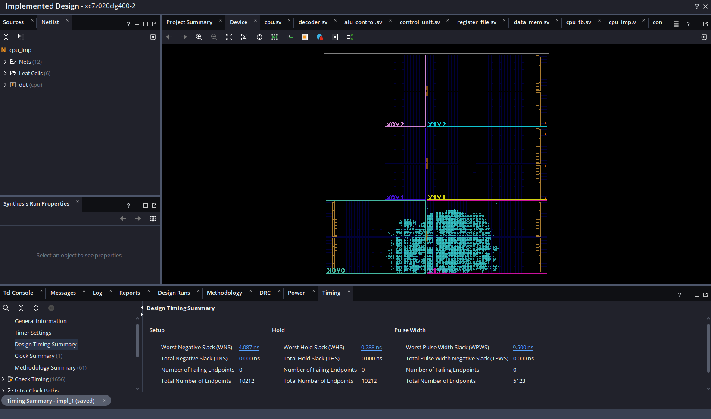
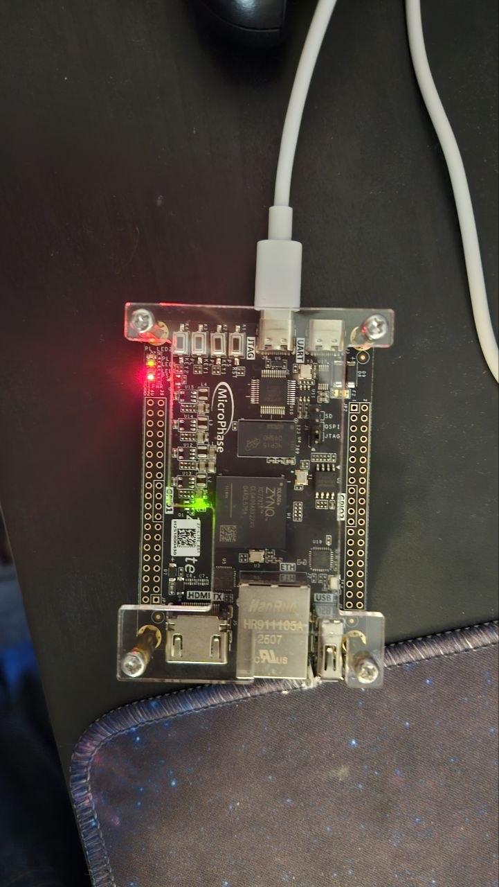

# Single-Cycle RISC-V (RV32I) CPU

A single-cycle RV32I processor written from scratch in SystemVerilog, verified against a
custom Python golden reference model, and synthesized/implemented onto a Xilinx Zynq-7020
SoC (Z7-Lite dev board).

<!-- 
  DIAGRAM: top-level datapath block diagram
  (PC -> Instruction Mem -> Decoder -> Control Unit -> Register File / ALU -> Data Mem -> back to PC)
  
-->

---

## Overview

- **ISA:** RV32I (base integer instruction set) — arithmetic/logic, immediate ops, loads/stores
  (byte/half/word, signed & unsigned), branches, `jal`/`jalr`, `lui`/`auipc`.
- **Microarchitecture:** classic single-cycle datapath — one instruction fetched, decoded,
  executed, and retired per clock edge. No pipelining, no hazards to forward.
- **Verification:** every instruction's behavior is cross-checked against a bit-accurate
  Python model of the ISA, using both directed and constrained-random test programs.
- **Hardware:** implemented and run on a Xilinx Zynq-7020 (XC7Z020), driving onboard LEDs
  from architectural register state as a physical correctness demo.

---

## Architecture

| Module | Responsibility |
|---|---|
| `pc.sv` | Program counter register |
| `instruction_mem.sv` | ROM, loaded from `program.hex` via `$readmemh` |
| `decoder.sv` | Decodes all RV32I instruction formats (R/I/S/B/U/J) into opcode/funct/regs/immediate |
| `control_unit.sv` | Opcode → control signal lookup (RegWrite, MemRead/Write, ALUSrc, Branch, Jump, ...) |
| `alu_control.sv` | Resolves the specific ALU operation from `ALUOp` + `funct3`/`funct7` |
| `alu.sv` | 32-bit ALU: add/sub, bitwise, shifts, signed/unsigned compare |
| `register_file.sv` | 32×32-bit register file, x0 hardwired to zero |
| `data_mem.sv` | Byte-addressable data memory with per-byte write enables |
| `cpu.sv` | Top-level datapath wiring everything together |
| `cpu_imp.v` | Board-level wrapper (clock/reset/LED I/O) for FPGA implementation |

<!--
  DIAGRAM: control signal / mux diagram (ALUSrc mux, MemtoReg mux, PCSrc mux)
  
-->

---

## Verification

Correctness is checked two ways:

**1. Golden-model co-simulation.** [`golden_model.py`](golden_model.py) is a cycle-accurate,
bit-accurate reimplementation of the CPU's architectural behavior in plain Python — same
decode logic, same ALU semantics, same control signal derivation, same memory model. It runs
instructions and produces a full register/memory/PC snapshot after execution completes.

**2. Constrained-random regression testing.** [`gen_random_tests.py`](gen_random_tests.py)
generates randomized-but-guaranteed-to-terminate RV32I programs (forward-only control flow,
safely bounded memory addresses) and runs each one through the golden model to produce an
expected state dump. The same `program.hex` is then run through the RTL, and
[`compare_dumps.py`](compare_dumps.py) diffs the two, reporting the exact register/memory
location and cycle where they first disagree.

```
gen_random_tests.py  →  program.hex + expected.txt   (golden model)
        ↓
      RTL sim (cpu_tb.sv)  →  actual.txt
        ↓
compare_dumps.py  →  PASS / FAIL + first mismatch
```

**Bugs found and fixed via this flow:**
- Loads (`LB`/`LH`/`LBU`/`LHU`) originally returned the raw 32-bit word instead of
  extracting and sign/zero-extending the addressed byte/halfword.
- `SRLI` vs `SRAI` selection depended on an inferred latch (`funct7` was undriven in the
  decoder's I-type branch), making the result depend on whatever instruction executed
  previously.
- `JALR` didn't clear the target address's LSB per spec.
- Store data wasn't shifted into the correct byte lane before reaching memory, so
  `SB`/`SH` at a non-zero offset within a word wrote the wrong bits.




- Waveform lining up with tb and golden model predicted output

- `[MONITOR] t=155000 PC=000000a0 WRITE x1 = 00000002`
---

## Hardware Implementation

Implemented on a **Xilinx Zynq-7020** (Z7-Lite dev board) using Vivado.

- **Clock:** 50 MHz onboard oscillator
- **I/O:** onboard push-button reset, onboard LEDs driven from register `x1`'s low bits
  (`assign leds = regs[1][1:0];`) as a physical "it's alive" indicator
- **Result:** closed timing with **8.7 ns worst negative slack**

Getting the design to fit and close timing surfaced its own class of bugs, separate from
ISA correctness:

- An LED pin was originally constrained to a PS-only I/O (`E6`), which Vivado's placer
  correctly rejected — fixed by remapping to the actual PL-controllable LED pins.
- The data memory's read port was conditionally gated (`if (MemRead) ... else ...`),
  which broke Vivado's memory-inference pattern matching entirely and caused the 512-word
  memory to synthesize as ~65K individual flip-flops with thousands of unique per-word
  write-enable control sets — blowing past the device's slice capacity. Fixed by making
  the read unconditional (`assign read_data = mem[location];`), restoring inference to
  efficient distributed RAM.


- Results of timing analysis after final modifications



- LEDs lit based on program execution, `x1 = 32b'010` so LED 0 is off and LED 1 is on (GREEN IS LED 1, RED is POWER)

---

## Repo Structure

```
├── alu.sv                 # ALU
├── alu_control.sv         # ALU op decode
├── control_unit.sv        # Main control signal generation
├── decoder.sv              # Instruction decode
├── register_file.sv        # 32x32 register file
├── data_mem.sv              # Data memory
├── instruction_mem.sv       # Instruction ROM
├── pc.sv                    # Program counter
├── cpu.sv                   # Top-level datapath
├── cpu_imp.v                 # FPGA board wrapper
├── cpu_tb.sv                 # RTL driver/monitor testbench
├── program.hex                # Sample program image
├── golden_model.py            # Python golden reference model
├── gen_random_tests.py         # Constrained-random test generator
└── compare_dumps.py            # Golden-model vs. RTL diff tool
```

---

## Running It

**Python golden model:**
```bash
python3 golden_model.py program.hex -v
```

**Generate a random regression suite:**
```bash
python3 gen_random_tests.py --count 200 --instrs 50 --seed 12345 --outdir tests
```

**Compare RTL output against the golden model:**
```bash
python3 compare_dumps.py tests/test_0000/expected.txt actual.txt
```

---

## Tools

`SystemVerilog` · `Xilinx Vivado` · `Python`

